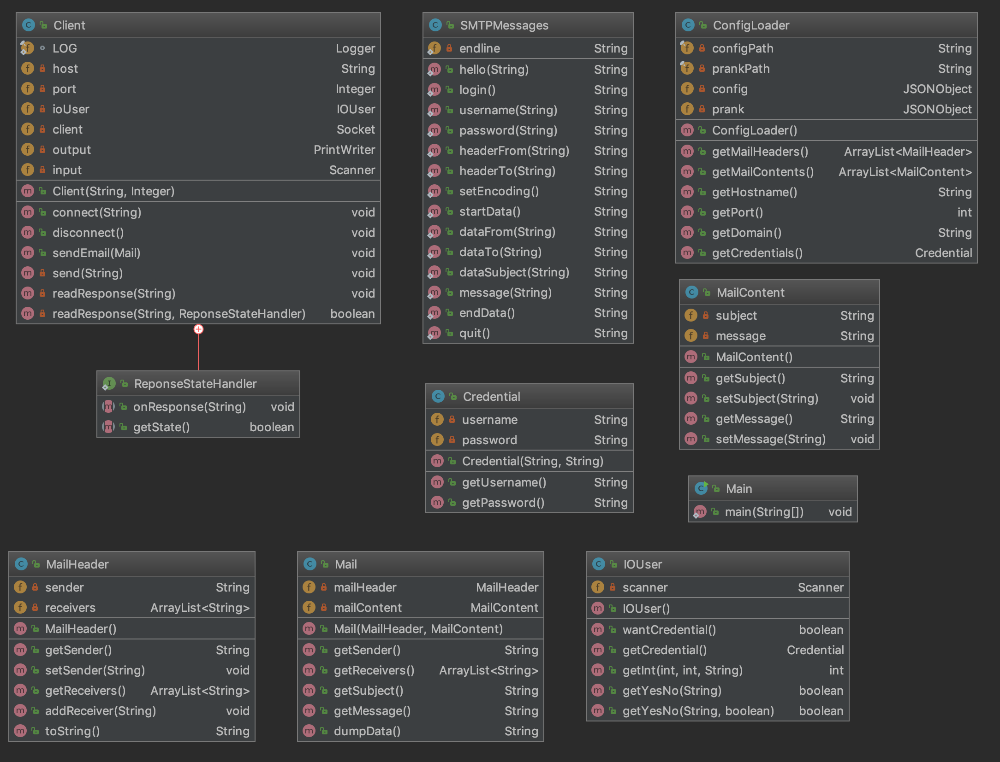

# SMTP Client for prank mail

## Description

Ce projet permet d'effectué des envois de mails forgés à des adresses arbitraires.
Il est facilement configurable à l'aide de ses fichiers de configuration.
Il vous proposera de choisir le message a envoyé à chaque groupe générer de manière aléatoire donné de manière intéractive.
La gestion d'authentification est intéractive et demandé automatiquement si le serveur gère la fonctionalité de login.

## Utilisation avec MockMock: Mock SMTP serveur

## Usage

Les deux configurations suivantes permettent de définir le comportement et le serveur cible d'envoi. Ils sont au format JSON.

**config.json** permet de spécifié le serveur cible (*hostname* + *port*) et le domaine d'annonce vers le serveur.
Voici un exemple simple permettant de voir la structure nécessaire.

```json
{
  "hostname": "localhost",
  "port": 1025,
  "domain": "local",
  "log_level": "INFO"
}
```

Le champs `domain` peut être une chaîne vide (`""`), dans le sens où ce domaine n'a pas réellement d'impacte pour une simulation.
Autrement, il devra évidemment renseigner une annonce valide pour le serveur choisi.

le champ `log_level` permet d'afficher plus informations, les valeurs de ce champs doivent être les différents types de Level java.
Nous vous conseillions les niveaux `INFO`, `ALL` ou `SEVERE`.

**prank.json** permet de définir une liste de groupes (possédant un envoyeur et au moins deux victimes), 
ainsi qu'une liste de mails qui seront proposés à de l'exécution du programme.
Voici un exemple simple permettant de voir la structure des différentes informations.
```json
{
  "groups": [
    {
      "sender": "sender1@mail.org",
      "receivers": [
        "receiver1@mail.org",
        "receiver2@mail.org"
      ]
    }
  ],
  "mails": [
    {
      "subject": "sujet en français",
      "message": "Test de contenu avec\nDes\nRetour à la ligne !"
    }
  ]
}
```

La configuration ci-dessus permet de définir un tableau `groups` d'objet `json` définissant chacun l'envoyeur et le tableau des receveurs, 
qui doivent être au nombre de deux au minimum.
La tableau `mails` défini un ensemble d'objets contenant chacun un sujet et un message qui seront proposés à l'utilisateur lors de l'execution.


## Implementation



La class Client est la classe principal s'occupant de guérer la connection avec le serveur et d'envoyer les emails à l'aide de la class SMTPMessages qui fourni un ensemble de fonction permettant de générer les messages smtp.

La class IOUser contient l'ensemble des méthodes pour dialoguer avec l'utilisateur, permettant de récuperer les informations nécessaires durant le déroulement.

Les models Credential, Mail, MailHeader et MailContent sont utilisé pour stocké les valeurs avant l'envoi.
MailHeader contient les différents informations envoyés avant les données (envoyeur, receveur), le MailContent contient les données du mail (subject, message).
Mail est une instance contenant un MailHeader et un MailContent pour modéliser un mail complet.
Credential stock les crédentials de l'utilisateur en base64.

Le ConfigLoader s'occupe de récupérer et mettre à disposition l'ensemble des informations présentent dans la configuartion.

Pour l'authentification, nous demande si l'authentification est voulu uniquement dans le cas où l'option est présent.
Lors de la lecture des reponses du serveur, il est possible donner un visiteur qui recevera l'ensemble des messages.


